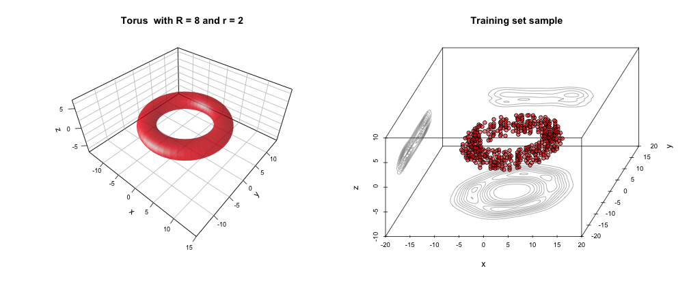

## Application overview
- '<b>Guess-the-Torus</b>' is a web application 
for binary classification performance comparison of several machine learning 
algorithms    
- The published web application was developed for a single algorithm but 
implements the functionality illustrated in this presentation    
- The web application was developed in R using the '<b>shiny</b>' package and is 
published at http://onlineclass.shinyapps.io/GuessTheTorus    
- Following is the sequence of tasks performed by the application:
    - Generate two data sets (one for model training and one for test)
    - Plot a sample taken from the training data set
    - Train several classification models on the training data set and plot the 
    ROC curves of the model performance estimated on the test data set
    - Estimate the 'outcome' for the user-specified predictor values using each 
    of the trained models and compare the predictions with the computed value of 
    the 'outcome'

--- .class #id 

## Data sets

The application generates two data sets, each having 4 columns and a 
user-specified number rows. The first three columns (labeled 'x', 'y' and 'z') 
are the Cartesian coordinates of a point in the 3D space and the last column 
(a factor labeled 'outcome') has a value of 'inside' or 'outside', depending on 
whether the point is inside or outside of the torus with equation 
 $\( R - \sqrt{x ^ 2 + y ^ 2} \) ^ 2 + z ^ 2 = r ^ 2$ 
 and parameters  $r = 2$,  $R = 8$ 
 

--- .class #id 

## Model training

- In order to preserve the responsiveness of the web interface, the only model 
trained in the simplified web application is <b>Weighted k-Nearest Neighbors</b> 
using the <b>kknn</b> function in the <b>kknn</b> package
- In this presentation, the <b>train</b> function from the <b>caret</b> package is 
used to train the folowing models:
    - <b>Linear Discriminant Analysis</b> (<b>method = "lda"</b>) - expected to perform 
    poorly on the nonlinear and non-convex volume, LDA is used as the reference 
    model
    - <b>Decision Trees</b> (<b>method = "rpart"</b>) - uses the classification trees 
    routines from the <b>rpart</b> package
    - <b>Random Forests</b> (<b>method = "rf"</b>) - uses the <b>randomForest</b> package
    - <b>Stochastic Gradient Boosting</b> (<b>method = "gbm"</b>) - uses the <b>gbm</b> 
    package
- All <b>train</b> function calls use the default parameters - models not optimized
- The performance of the models is estimated on the test data set and the ROC 
curves plotted using the <b>ROCR</b> package

- The training and performance estimation of each model is performed with the 
following sequence of calls:
<ul>
<li style="font-size: 16px; text-align: left; color: green;"><b>xxxFit <- train(outcome ~ ., data = train.data, method = "xxx")</b></li>
<li style="font-size: 16px; text-align: left; color: green;"><b>xxxPred <- prediction(predict(xxxFit, test.data, type = "prob")$inside, test.data$outcome)</b></li>
<li style="font-size: 16px; text-align: left; color: green;"><b>xxxPerf <- performance(xxxPred, "tpr", "fpr")</b></li>
</ul>

--- .class #id 

## Model performance and Prediction

- Models' performance is illustrated in the plot containing the ROC curves (one 
for each model)    
 
- The simplified web application (using a k-Nearest Neighbors model) allows the 
user to specify a point in the 3D space via the 3 Cartesian coordinates (x, y 
and z) and then displays the position of the point ("inside torus" or "outside 
torus") as predicted by the model and the true position (computed using the 
equation of the torus).
